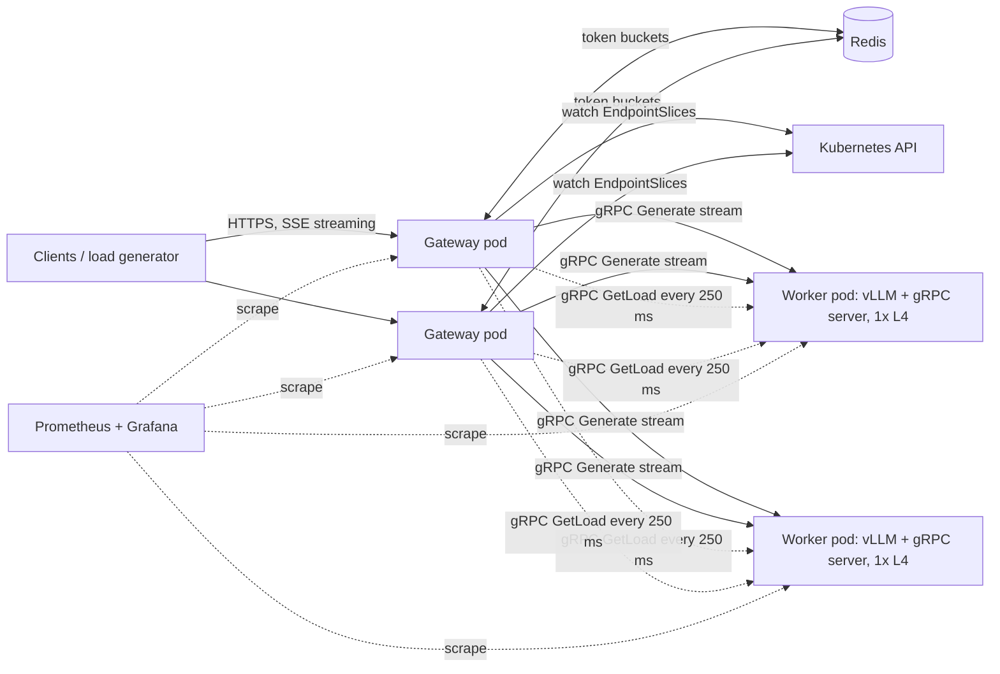

# Switchyard: a self-hosted LLM inference platform on Kubernetes

## 1. Summary

Switchyard serves an open-weight LLM (Qwen3-8B) on GPU replicas running vLLM inside Kubernetes, behind a Go gateway that exposes an OpenAI-compatible API. The gateway talks to the model workers over gRPC and decides which replica handles each request using live load signals (KV cache usage, queue depth) and prompt-prefix affinity. It also enforces per-key rate limits, sheds load when the fleet is saturated, and routes around failing replicas with circuit breakers.

The deliverable is not just a working system. It is a reproducible benchmark report that answers four questions with numbers:

1. How much throughput does continuous batching buy over one-request-at-a-time serving on one GPU?
2. Which vLLM batching and KV cache settings give the most requests per second while still meeting a latency target?
3. How much does load-aware and prefix-aware routing improve tail latency over round-robin?
4. How does the system behave when it is overloaded or when a replica dies mid-traffic?

### Why this project

It turns the skills on the resume (Kubernetes, gRPC, vLLM, KV cache, continuous batching, load balancing, rate limiting, circuit breaking) into things built and measured firsthand. It also extends the Cortex gateway story: Cortex routed requests to hosted model providers; Switchyard routes to GPUs you operate yourself, so you own the inference layer too.

## 2. Goals and non-goals

### Goals

- Serve Qwen3-8B with streaming responses through an OpenAI-compatible endpoint.
- Run everything on Kubernetes: gateway, GPU workers, Redis, and monitoring.
- Write the gateway in Go, including the gRPC client, routing, rate limiting, and circuit breaking.
- Compare four routing policies on the same workload.
- Publish a benchmark report with methodology, hardware, versions, and charts.
- Keep total cloud spend under $150.

### Non-goals

- Training or fine-tuning.
- Multi-node tensor parallelism or models that don't fit on one GPU.
- Writing a custom inference engine. vLLM is the engine; the work is around it.
- A UI, user accounts, or billing. API keys live in a config file.

## 3. Architecture



### Request path

1. The client sends `POST /v1/chat/completions` with an API key.
2. The gateway authenticates the key and reserves estimated tokens against the key's limits in Redis.
3. Admission control checks whether any replica can take the request within the latency target. If none can, it returns `429` with `Retry-After`.
4. The router picks a replica using the active policy and the latest load reports.
5. The gateway opens a gRPC `Generate` stream to that worker and relays tokens to the client as server-sent events.
6. On completion, the gateway settles actual token usage in Redis and records metrics.
7. If the client disconnects, the gateway cancels the gRPC stream, and the worker aborts the vLLM request to free its KV cache blocks.

## 4. Components

### 4.1 Gateway (Go)

**HTTP API**

| Endpoint | Purpose |
|---|---|
| `POST /v1/chat/completions` | OpenAI-compatible subset: `messages`, `max_tokens`, `temperature`, `top_p`, `stream`. Returns `usage` |
| `GET /v1/models` | Lists the served model |
| `GET /healthz` | Liveness |
| `GET /metrics` | Prometheus metrics |

**Replica discovery.** Use a client-go informer on the EndpointSlices of the workers' headless Service. Route only to endpoints marked ready. This needs a ServiceAccount with `get`, `list`, and `watch` on `endpointslices`.

**Load reports.** Poll each replica's `GetLoad` RPC every 250 ms. Treat a report older than 1 s as stale and fall back to the gateway's own count of in-flight requests for that replica.

**Routing policies.** Make the policy a config value so all four run against the same build:

| Policy | Rule |
|---|---|
| `round_robin` | Baseline |
| `least_outstanding` | Fewest in-flight requests, counted by this gateway |
| `kv_aware` | Lowest score `kv_cache_usage + α · waiting / max_num_seqs`, using worker-reported load |
| `prefix_affinity` | Consistent hashing on a prefix key with bounded loads: send to the prefix's home replica unless that replica's load exceeds `(1 + ε) ×` the fleet average, then fall through to `kv_aware` |

The prefix key is a hash of the system message, or of the first 2 KB of the conversation if there is no system message. Requests that share a system prompt then land on the replica whose vLLM prefix cache already holds it, which skips most of the prefill work.

**Rate limiting.** Use per-key token buckets on two axes, requests per minute and tokens per minute, stored in Redis and updated by a Lua script so multiple gateway replicas stay consistent. The flow is reserve then settle:

- At admission, reserve the input tokens (estimated as characters ÷ 4) plus `max_tokens`.
- On completion, refund the difference between the reservation and actual usage.

**Resilience**

- **Circuit breaker per replica.** It opens after 5 consecutive failures or a >50% error rate over 20 requests. It stays open for 10 s, then half-opens and allows one probe request.
- **Retries.** Retry on a different replica only if the failure happens before the first token reaches the client. Cap retries at 10% of recent requests (a retry budget) so a sick fleet can't trigger a retry storm.
- **Deadlines.** Every gRPC call carries a deadline, and client disconnects propagate as cancellation.
- **Admission control.** If every eligible replica has more than `max_waiting` queued requests, shed the request with `429` instead of letting queues grow without bound.

**Metrics**

- Histograms for time to first token (TTFT), time per output token (TPOT), and end-to-end latency, labeled by policy and replica.
- Counters for input tokens, output tokens, rate-limited requests, shed requests, retries, and cancellations.
- A gauge for circuit breaker state.

### 4.2 Worker (Python + vLLM)

There is one worker process per GPU pod: a `grpcio` asyncio server that runs vLLM's async engine in-process.

- `Generate` applies the model's chat template, submits the request to the engine, and streams token chunks back. On stream cancellation it calls the engine's abort for that request ID.
- `GetLoad` reads vLLM's in-process Prometheus metrics:
  - running requests (`vllm:num_requests_running`)
  - waiting requests (`vllm:num_requests_waiting`)
  - KV cache usage (named `vllm:kv_cache_usage_perc` in recent versions, `vllm:gpu_cache_usage_perc` in older ones)
  - prefix cache hit counters
- The worker implements the standard `grpc.health.v1` health service. It reports `SERVING` only after the model is loaded and one warmup request has finished.

**Pin the vLLM version.** Its Python engine API changes between releases. If the in-process engine becomes a time sink, the fallback is to run vLLM's stock OpenAI server in the pod with a thin gRPC adapter next to it that forwards requests over localhost and scrapes `/metrics`. That design works too, but costs an extra hop.

### 4.3 Mock worker (Go)

A mock worker implements the same proto with no GPU, so the gateway, routing, and Kubernetes manifests can be developed on a laptop. It simulates:

- prefill time proportional to uncached prompt tokens
- decode time per token that rises with batch size
- a fixed KV cache capacity with queueing once it's full
- an LRU prefix cache

This lets you develop routing on a laptop and run 8–16-replica routing experiments for free. **Simulated results are for development only.** Every number on the resume comes from real GPU runs.

### 4.4 Load generator (Go)

- Open-loop Poisson arrivals at a target requests per second. A closed-loop client slows down whenever the server does, which hides queueing delay. This flaw is known as coordinated omission.
- Streams every response and records TTFT, TPOT, end-to-end latency, input and output tokens, and status per request. Writes JSON lines and prints percentile summaries.
- Fixes output length per request (`max_tokens` with `ignore_eos`) and turns off Qwen3's thinking mode, so runs are comparable.
- Two workloads:
  - **chat:** prompt and output lengths sampled from a public ShareGPT dataset (the same kind vLLM's own benchmarks use).
  - **shared_prefix:** 10 system prompts of 1,500–2,000 tokens, picked with a Zipf distribution, each followed by a short user question. This workload is where prefix-aware routing should show its value.
- Sanity-check the load generator's single-replica numbers against `vllm bench serve` once.

### 4.5 Observability

- kube-prometheus-stack, installed via Helm, with ServiceMonitors for the gateway and workers.
- One Grafana dashboard, committed as JSON: request rate, TTFT and TPOT percentiles, per-replica KV cache usage and queue depth, prefix cache hit rate, breaker states, and rate of shed and retried requests.

## 5. gRPC contract

```protobuf
syntax = "proto3";
package switchyard.v1;

service InferenceWorker {
  rpc Generate(GenerateRequest) returns (stream GenerateChunk);
  rpc GetLoad(GetLoadRequest) returns (LoadReport);
}

message ChatMessage {
  string role = 1;
  string content = 2;
}

message SamplingParams {
  uint32 max_tokens = 1;
  float temperature = 2;
  float top_p = 3;
  bool ignore_eos = 4;
}

message GenerateRequest {
  string request_id = 1;
  repeated ChatMessage messages = 2;
  SamplingParams sampling = 3;
}

message GenerateChunk {
  string text = 1;
  uint32 output_tokens = 2;          // cumulative
  uint32 prompt_tokens = 3;          // set on the first chunk
  uint32 cached_prompt_tokens = 4;   // set on the first chunk, if the engine exposes it
  string finish_reason = 5;          // set on the last chunk
}

message GetLoadRequest {}

message LoadReport {
  uint32 num_running = 1;
  uint32 num_waiting = 2;
  float kv_cache_usage = 3;          // 0.0 to 1.0
  uint32 max_num_seqs = 4;
  uint64 prefix_cache_queries = 5;   // cumulative tokens
  uint64 prefix_cache_hits = 6;      // cumulative tokens
}
```

## 6. Infrastructure

### Cluster

- **Local:** a kind cluster on the Mac running the gateway, mock workers, Redis, and monitoring. The Helm chart is the same; only the values file changes.
- **Cloud:** GKE Standard with two node pools:
  - `system`: 2 small CPU nodes for the gateway, Redis, and monitoring.
  - `gpu`: spot `g2-standard-8` nodes with one NVIDIA L4 (24 GB) each, autoscaling between 0 and 2 nodes.
- Let GKE install the NVIDIA drivers. Worker pods request `nvidia.com/gpu: 1`, select the L4 node pool, and tolerate its GPU taint.

### Model and memory budget

Use Qwen3-8B (Apache 2.0, no gated download) in BF16, with `max_model_len` set to 8192.

Work out the KV cache budget before the first deploy, because you will be asked about this math in interviews:

- **Weights:** about 8.2B parameters × 2 bytes ≈ 16.4 GB.
- **KV cache per token:** 2 (K and V) × 36 layers × 8 KV heads × 128 head dimension × 2 bytes = 147,456 bytes ≈ 144 KiB.
- **Available memory:** with `gpu_memory_utilization=0.90`, 21.6 GB − 16.4 GB of weights − about 1.5 GB of activations and CUDA graphs ≈ 3.7 GB for KV cache.
- **Result:** roughly 25K cached tokens per GPU. That is only about three full 8K-token conversations, so KV cache pressure will be visible early, which suits this project.

If it doesn't fit, drop to Qwen3-4B. FP8 weights (which the L4 supports) free about 8 GB, roughly tripling the KV budget; that comparison is an optional experiment.

### Kubernetes objects (Helm chart)

- Gateway: a Deployment with 2 replicas, a Service, a ServiceAccount with RBAC, and a ConfigMap holding API keys and policy config.
- Workers: a Deployment plus a headless Service.
  - A `startupProbe` allows up to 10 minutes for the model to load.
  - `readinessProbe` uses Kubernetes' native gRPC health check.
  - Model weights are cached on a PersistentVolumeClaim so restarts don't re-download about 16 GB.
- Redis: one Deployment. Durability isn't needed; limits can reset.
- A values file for each target: `values-kind.yaml` and `values-gke.yaml`.

### Cost control

- Request GPU quota on day 1 (the L4 quota in your region, plus the global GPU quota). New projects start at 0, and approval can take days. GCP free-trial accounts generally can't use GPUs, so upgrade to a paid account first.
- Set a billing budget alert at $50, $100, and $150.
- Scale the `gpu` pool to 0 nodes after every benchmark session.
- Spot preemption is acceptable here; rerun the affected experiment.
- If L4s are out of stock in your zone, try another zone, or use AWS EKS with `g6.xlarge` (also an L4).

## 7. Benchmark plan

### Metrics

| Metric | Definition |
|---|---|
| TTFT | Time from request sent to first token received |
| TPOT | (End-to-end latency − TTFT) ÷ (output tokens − 1) |
| Throughput | Output tokens per second across the fleet |
| Goodput | Requests per second that meet the latency target |
| Prefix cache hit rate | Cached prompt tokens ÷ total prompt tokens |

**Latency target:** P99 TTFT ≤ 2 s and P99 TPOT ≤ 100 ms. Revise these after the first single-replica run if they turn out to be unrealistic for the L4, and record the final values in the report.

### Experiments

Each experiment produces one chart and one headline number.

| # | Experiment | Setup | Headline number |
|---|---|---|---|
| E1 | Continuous batching | 1 replica, chat workload. `max_num_seqs=1` vs the default, sweeping request rate | Throughput gain at saturation |
| E2 | Batching and KV tuning | 1 replica. Sweep `max_num_seqs`, `max_num_batched_tokens`, chunked prefill, and prefix caching on/off. Track preemptions | Highest request rate that meets the latency target, before vs after tuning |
| E3 | Routing | 2 GPU replicas, shared_prefix workload, all 4 policies at the same request rate. Repeat on 8 mock replicas to check that the effect holds at a larger fleet size | P99 TTFT and prefix cache hit rate, `prefix_affinity` vs `round_robin` |
| E4 | Overload | 2 replicas at 1.5× and 2× saturation, admission control on vs off | Goodput and P99 TTFT with vs without load shedding |
| E5 | Replica failure | Steady load at 60% of capacity. Delete a worker pod at t = 60 s | Failed requests, seconds until traffic stops going to the dead replica, and full cold-start time (node, image pull, model load) |
| E6 | Gateway overhead | Low load, direct-to-worker vs through-gateway | Added P50 and P99 latency in milliseconds |
| E7 (optional) | FP8 weights | Repeat E2's best config with FP8 | KV cache capacity and throughput change |

### Methodology rules

- Warm up for 30 s before measuring, measure for at least 3 minutes, and run every configuration 3 times. Report the median run and the spread across runs.
- Record the GPU type, driver, CUDA, vLLM, and model versions, plus the full config, for every run in `bench/results/`.
- Generate the charts from raw results with a script, never by hand.

## 8. Milestones

The plan assumes about 15 hours a week, for 5 weeks.

| Week | Milestone | Exit criteria |
|---|---|---|
| 1 | Local skeleton: proto, Go gateway (streaming), mock worker, Helm chart, kind cluster, load generator v1. Request GPU quota | `curl -N` streams tokens through gateway → mock worker inside kind |
| 2 | Real GPU: GKE cluster, vLLM worker, Qwen3-8B served end to end. Run E1 and E2 | First single-replica charts committed |
| 3 | Routing: EndpointSlice discovery, `GetLoad` polling, all 4 policies, Redis rate limiter. Run E3 | Routing comparison chart committed |
| 4 | Resilience: circuit breaker, retry before first token, cancellation → abort, admission control. Run E4 and E5 | Overload and failure results committed |
| 5 | Grafana dashboard, E6, README with diagram, results, and reproduction steps. Write resume bullets | Public GitHub repo |

Don't cut corners on the mock worker in week 1. Every later milestone gets faster if routing and Kubernetes bugs show up on the laptop instead of on a paid GPU.

## 9. Repository layout

```
switchyard/
├── proto/switchyard/v1/inference.proto
├── gateway/            # Go: HTTP API, router, ratelimit, breaker, discovery
├── worker/             # Python: gRPC server wrapping vLLM
├── mockworker/         # Go: GPU-free worker for local dev
├── loadgen/            # Go: open-loop load generator
├── deploy/
│   ├── helm/switchyard/
│   ├── values-kind.yaml
│   ├── values-gke.yaml
│   └── grafana-dashboard.json
├── bench/
│   ├── results/        # raw JSONL per run, plus run config
│   ├── plot.py
│   └── BENCHMARK.md
├── Makefile            # kind-up, deploy-local, gke-up, gpu-scale-0, bench-e1 ... bench-e6
└── README.md
```

## 10. Resume entry

Fill in the brackets only with measured numbers from the benchmark report.

**Switchyard (LLM Inference Platform)** | Go, Python, gRPC, vLLM, Kubernetes

- Built a self-hosted LLM inference platform that serves Qwen3-8B across GPU replicas on Kubernetes behind an OpenAI-compatible Go gateway with per-key rate limiting, load shedding, and circuit breaking
- Designed KV-cache- and prefix-aware routing that cut P99 time-to-first-token by [X]% and raised prefix cache hits to [Y]% versus round-robin at [Z] requests/sec
- Tuned vLLM continuous batching and KV cache settings to serve [N] tokens/sec per L4 GPU, [M]x the unbatched baseline, while holding P99 latency targets

Adding this entry will push the page over one; it would replace the SOCR Lab entry or the third Weenix bullet.

## 11. Concepts to be able to explain

The resume now lists these keywords, so expect to be asked about each:

- Prefill vs decode, and why prefill is compute-bound while decode is memory-bandwidth-bound
- How KV cache size is calculated per token, and why it limits batch size
- PagedAttention, and why paged KV memory allows larger batches
- Continuous (iteration-level) batching vs static batching, and chunked prefill
- Prefix caching, and why routing affects its hit rate
- TTFT, TPOT, throughput, and goodput, and why P99 matters more than the mean
- Why least-loaded beats round-robin when request lengths vary widely, and consistent hashing with bounded loads
- gRPC vs REST between services: HTTP/2 multiplexing, streaming, protobuf contracts, deadlines, and cancellation propagation
- How Kubernetes schedules GPU pods (device plugin, taints and tolerations), the difference between startup, readiness, and liveness probes, and how Services and EndpointSlices work
- Token bucket vs sliding-window rate limiting, and why distributed limits need atomic updates
- Circuit breaker states, retry budgets, and retry storms
- Open-loop vs closed-loop load testing, and coordinated omission

## 12. Risks

| Risk | Mitigation |
|---|---|
| GPU quota denied or L4s out of stock | Request quota on day 1, try other zones, or fall back to AWS `g6.xlarge` |
| vLLM engine API changes break the worker | Pin the version; fall back to the stock OpenAI server plus a gRPC adapter |
| Cloud bill overruns | Scale the GPU pool to 0, set budget alerts, and do most development on kind |
| Routing gains are too small to show on 2 replicas | The shared_prefix workload is designed to expose them; confirm the trend on 8 mock replicas, but put only real numbers on the resume |
| Spot nodes preempted mid-benchmark | Rerun; methodology already requires 3 runs per configuration |
